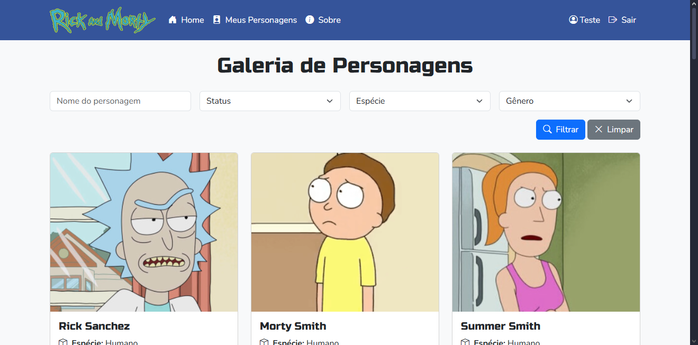

# 🛸 Rick and Morty Collection



### Idiomas/Languages

- [Português](#português)
- [English](#english)

### Português

Aplicação desenvolvida com PHP (Laravel 12) e Vite, que permite explorar, salvar e organizar personagens da série Rick and Morty. O projeto conta com filtros avançados, sistema de cache, conquistas desbloqueáveis e design responsivo.

Na tela principal (`home`), é possível aplicar filtros por `nome`, `espécie`, `gênero` e `status` para buscar personagens. Ao clicar em um personagem (imagem ou botão), você acessa os detalhes e pode salvá-lo em sua coleção (caso esteja autenticado).

Na tela de `details`, é possível excluir personagens salvos ou visualizar todos que foram coletados. Ao completar os 5 grupos principais da série, uma badge animada é desbloqueada.

Você pode visualizar a badge com o usuário abaixo:

```bash
email: teste@teste.com
senha: 12345678
```

As telas de autenticação foram estilizadas e possuem regras de segurança para senhas: é necessário utilizar pelo menos 8 caracteres, incluindo letras maiúsculas, minúsculas e números.

Além disso, há uma página de contato com mais informações e projetos do desenvolvedor.

### Tecnologias

- **Laravel 12**
- **Vite + Bootstrap 5**
- **Docker + Nginx**
- **PHP 8.2**
- **SQLite**

### Requisitos

Para rodar localmente (fora do Docker):

- PHP >= 8.2 (pode usar o [XAMPP](https://www.apachefriends.org/index.html))
- Composer
- Node.js >= 18 e npm
- SQLite 

## Como rodar?

> **Obs**: O arquivo `.env` e o banco de dados (``database/database.sqlite``) já estão configurados dentro da pasta rick-and-morty/ para facilitar os testes.

###  Usando Docker

```bash
# Clone o projeto
git clone https://github.com/gmgpx/vitafor_crud_test.git

# Entre no projeto
cd rick-and-morty

# Rodar container
docker-compose up --build
```

### Instalação Manual (XAMPP ou local)

```bash
# Clone o projeto
git clone https://github.com/gmgpx/vitafor_crud_test.git

# Entre no projeto
cd rick-and-morty

# Instale dependências do Laravel
composer install

# Gere a chave da aplicação
php artisan key:generate

# Instale dependências
npm install

# Compile os assets
npm run dev

# Inicie o servidor Laravel
php artisan serve
```

### Como usar?

1. Acesse a aplicação em `http://localhost:8000` após iniciar o servidor.
2. Use o login de teste ou crie sua conta.
3. Explore, filtre e salve personagens.
4. Complete os grupos para ganhar conquistas!

## English

### About

This application was built using PHP (Laravel 12) and Vite, and allows you to explore, save, and organize characters from the Rick and Morty series. It includes advanced filters, caching, unlockable achievements, and a responsive layout.

On the main screen (`home`), you can filter characters by `name`, `species`, `gender`, and `status`. Clicking on a character (image or button) opens the details view, where authenticated users can save characters to their collection.

In the `details` screen, you can remove saved characters or view all collected ones. Once you complete the 5 main character groups from the series, an animated badge is unlocked.

You can see the badge using the following demo user:

```bash
email: teste@teste.com
password: 12345678
```

Authentication screens are styled and include password validation rules: passwords must contain at least 8 characters, including uppercase letters, lowercase letters, and numbers.

The project also includes a contact page and links to other projects from the developer.

### Technologies

- **Laravel 12**
- **Vite + Bootstrap 5**
- **Docker + Nginx**
- **PHP 8.2**
- **SQLite**

### Requirements

To run locally (without Docker):

* PHP >= 8.2 (you can use [XAMPP](https://www.apachefriends.org/index.html))
* Composer
* Node.js >= 18 and npm
* SQLite

### How to run?

> **Note:** The `.env` file and the SQLite database (`database/database.sqlite`) are already included in the project root for easy testing.

### Using Docker

```bash
# Clone the project
git clone https://github.com/gmgpx/vitafor_crud_test.git

# Enter the project folder
cd rick-and-morty

# Run container
docker-compose up --build
```

### Manual installation (XAMPP or local)

```bash
# Clone the project
git clone https://github.com/gmgpx/vitafor_crud_test.git

# Enter the project folder
cd rick-and-morty

# Install Laravel dependencies
composer install

# Generate application key
php artisan key:generate

# Install npm dependencies
npm install

# Compile assets
npm run dev

# Start Laravel server
php artisan serve
```

### How to use?

1. Access the app at `http://localhost:8000` after starting the server.
2. Use the test login or create your own account.
3. Explore, filter, and save characters.
4. Complete the groups to earn achievements!